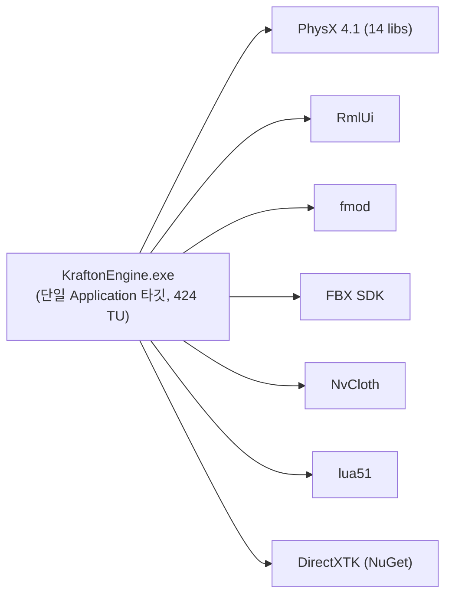
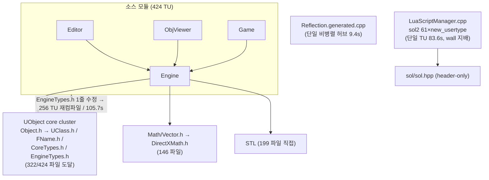

# 빌드 속도 진단 — 구조 점검 · sol2 병목 · PCH 도입 계획

> 작성일: 2026-06-05 · 측정 환경: **Debug x64 / MSVC 14.44 (VS2022 17.14) / 28 logical cores**
> 표기: **[측정]** = 실제 계측값 (`/Bt+`, `msbuild /clp:PerformanceSummary`, `/Yc`→`/Yu` 라운드트립) · **[추정]** = 측정값으로부터의 예측(반드시 재측정해야 하며 사실로 단정 금지)
>
> ⚠️ **측정 범위 한계**: 모든 수치는 **Debug(LTCG off)** 기준이다. Release·Game·Demo·ObjViewDebug 는 **LTCG(WholeProgramOptimization) on** 이라 링크가 별도의 직렬 병목이 되고, compile:link 비율과 wall 모델이 그대로 전이되지 않는다.

---

## 1. 요약 — 측정된 병목 위치

- **빌드는 압도적으로 컴파일 바운드.** clean 리빌드 112s = **CL(컴파일) 104.9s + Link 5.3s + 코드젠/postbuild 1.0s** → 컴파일이 wall의 ~94%, compile:link ≈ **20:1** (Debug, LTCG off). **[측정]**
- **컴파일 비용의 95%가 front‑end(헤더 파싱 + 템플릿 인스턴스화).** 총 compile‑CPU 1366 CPU‑sec = front‑end 1298.8s(95%) + back‑end 67.7s(5%). 평균 3.06s/TU. **[측정]**
- **clean‑build wall은 단일 TU 하나가 지배한다.** [LuaScriptManager.cpp](../KraftonEngine/Source/Engine/Lua/LuaScriptManager.cpp) = front 56.2s + back 27.4s = **83.6s**. 28코어라도 단일 TU는 못 쪼개지므로 wall이 이 아래로 안 내려간다(직렬화/Amdahl). **[측정]**
- **증분 빌드의 고통 = 모놀리식 + PCH 부재.** 공통 헤더 [EngineTypes.h](../KraftonEngine/Source/Engine/Core/Types/EngineTypes.h) 한 줄 수정 → **256/424 TU 재컴파일, 105.7s**(사실상 풀 리빌드). **[측정]**
- **두 개의 독립 병목**: (A) sol2 straggler가 wall을 게이팅(직렬화) · (B) 424 TU 전반의 front‑end 재파싱(throughput). **PCH는 (A)를 못 고치고, TU 분할은 (B)를 못 고친다.**

---

## 2. 빌드 구조

### 2.1 빌드 정의 파일 (전수)
| 파일 | 역할 |
|---|---|
| [KraftonEngine.sln](../KraftonEngine.sln) | 솔루션 — 프로젝트 **1개**만 포함 |
| [KraftonEngine.vcxproj](../KraftonEngine/KraftonEngine.vcxproj) | **유일한** MSBuild 프로젝트 (2651줄) |
| [GameBuild.bat](../GameBuild.bat) / [ReleaseBuild.bat](../ReleaseBuild.bat) / [PackageRelease.bat](../PackageRelease.bat) | `msbuild … /m /v:minimal` 래퍼 + 산출물 복사 |
| [GenerateProjectFiles.bat](../GenerateProjectFiles.bat) → [Scripts/GenerateProjectFiles.py](../Scripts/GenerateProjectFiles.py) | vcxproj 의 ClCompile 목록 생성기 |
| [Scripts/GenerateHeaders.py](../Scripts/GenerateHeaders.py) | UHT‑lite 리플렉션 코드젠 (매 빌드 PreBuildEvent) |

> **CMake/Ninja/자체 *.props·*.targets 미발견.** 브리프의 "CMake" 전제와 달리 **순수 단일 MSBuild** 구조다. (`directxtk_*.targets`는 NuGet 패키지 소유)

### 2.2 타깃 / 컴파일 단위
- **타깃: 단일 `Application`(.exe) 1개.** 정적 라이브러리 분할 없음 → 타깃 간 의존성 그래프 자체가 없고, 외부 의존은 전부 **선빌드된 .lib/.dll**.
- **컴파일 단위 424개** (ClCompile 기준):

| 모듈 | .cpp 수 | 출처 |
|---|---|---|
| Engine | 350 | [vcxproj:468~](../KraftonEngine/KraftonEngine.vcxproj:468) |
| Editor | 54 | [vcxproj:414~](../KraftonEngine/KraftonEngine.vcxproj:414) |
| ThirdParty (ImGui 7 / imgui‑node‑editor 4 / NvCloth 3) | ~14 | [vcxproj:824~](../KraftonEngine/KraftonEngine.vcxproj:824) |
| ObjViewer | 4 | — |
| Game | 2 | — |
| 생성물 Reflection.generated.cpp | 1 | [vcxproj:837](../KraftonEngine/KraftonEngine.vcxproj:837) |
| 헤더(ClInclude) | 1319 | — |

### 2.3 빌드 타입 설정 ([ItemDefinitionGroup](../KraftonEngine/KraftonEngine.vcxproj:188))
| 항목 | Debug | Release / Game / Demo / ObjViewDebug |
|---|---|---|
| 병렬 컴파일 `/MP` | ✅ on | ✅ on |
| LTCG `WholeProgramOptimization` | ❌ off | ⚠️ **on** → 링크 느림 |
| 최적화 | Od | `/Gy /Gw` + Intrinsics |
| C++ 표준 | x64=**C++20**, Win32=미설정(기본 C++14) | x64=C++20 ([vcxproj:242](../KraftonEngine/KraftonEngine.vcxproj:242)) |
| 예외 | `/EHa`(Async, 무거움) | 동일 |
| 기타 | `/permissive- /utf-8 /bigobj`, SDLCheck | 동일 |

> 일관성 문제: **Win32 구성만 `LanguageStandard` 누락** → 같은 코드가 구성에 따라 다른 표준으로 컴파일.

### 2.4 기존 PCH 사용 여부
- **전무.** vcxproj 에 `PrecompiledHeader` 항목 0건 → MSBuild 기본값 `NotUsing`. `pch.h`/`stdafx.h` 없음. → **PCH greenfield(마이그레이션 리스크 없음).**

### 2.5 코드젠 (PreBuildEvent)
- [GenerateHeaders.py](../Scripts/GenerateHeaders.py) 가 매 빌드 실행. 측정 **0.4s**, **증분 안전**([write_if_changed](../Scripts/GenerateHeaders.py:2493) — 내용 변경 시에만 기록, dry‑run "0 changed"). **[측정]**
- 단, [Reflection.generated.cpp](../KraftonEngine/KraftonEngine.vcxproj:837) 는 enum 레지스트리 + **모든** per‑type 생성 cpp 를 `#include`하는 **단일 비병렬 허브 TU** ([GenerateHeaders.py:2466](../Scripts/GenerateHeaders.py:2466)). 측정 front 7.7s + back 1.7s.

---

## 3. 의존성 다이어그램 (Mermaid)

### 3.1 링크 관계 (단일 exe → 선빌드 외부 라이브러리)


### 3.2 내부 헤더 결합 핫스팟 (재컴파일 전파 경로)


---

## 4. 실측 결과

### 4.1 시나리오별 wall‑clock (Debug x64, 28 cores) **[측정]**
| 시나리오 | Wall | 내역 |
|---|---|---|
| 클린 리빌드 | **112s** | CL 104.9s · Link 5.3s · 코드젠+postbuild 1.0s |
| 무변경 증분(no‑op) | **2.0s** | 코드젠 0.4s + MSBuild 오버헤드 |
| 말단 .cpp 1개 변경 | **3.3s** | 재컴파일 1 TU |
| 코어 헤더 `EngineTypes.h` 변경 | **105.7s** | 재컴파일 **256/424 TU** (≈ 풀 리빌드) |
| 코드젠 단독(dry‑run) | 0.4s | 167 reflected, 증분 안전 |

### 4.2 컴파일 vs 링크 / 병렬화 **[측정]**
- 컴파일:링크 = 104.9s : 5.3s ≈ **20:1** → Debug 는 컴파일 바운드(LTCG off 라 링크 미미).
- front‑end:back‑end = 1298.8s : 67.7s = **95% : 5%** → 비용의 거의 전부가 헤더 파싱 + 템플릿 인스턴스화.
- 총 compile‑CPU 1366s 가 wall ~105s 로 압축 = **유효 병렬 ~13×**(가용 28코어 중). 이는 한 파일이 아니라 빌드 전반의 **stragglers(복수) + 스케줄링 갭** 때문이며, LuaScriptManager 가 가장 극단적인 tail.

### 4.3 가장 오래 걸리는 상위 TU (front‑end 기준) **[측정]**
```
 56.2s front  27.4s back   Engine\Lua\LuaScriptManager.cpp        ← 단일 TU 83.6s, wall 지배
  9.3s        0.8s         Engine\Component\Script\LuaBlueprintComponent.cpp
  8.3s        0.3s         Engine\GameFramework\World.cpp
  8.2s        0.7s         Engine\Animation\Instance\LuaAnimInstance.cpp
  7.8s        0.5s         Engine\Lua\LuaDebugManager.cpp
  7.7s        1.7s         Intermediate\Generated\Reflection.generated.cpp  ← 단일 리플렉션 허브
  7.2s        0.3s         Engine\Mesh\Importer\Fbx\FbxMaterialImporter.cpp
  7.1s        0.2s         Engine\Mesh\Importer\FbxImporter.cpp
  6.9s        0.5s         Editor\UI\Panel\EditorPropertyWidget.cpp
  …평균 front-end 3.06s/TU × 424
```

### 4.4 헤더 결합 도달 범위 **[측정]**
- UObject core cluster(`Object.h`→`UClass.h`/`FName.h`/`CoreTypes.h`/`EngineTypes.h`): **322/424 파일**
- `Math/Vector.h` → `<DirectXMath.h>`+`<intrin.h>` ([Vector.h:2-3](../KraftonEngine/Source/Engine/Math/Vector.h:2)): **146 파일**
- STL(`<vector>` 등) 직접: **199 파일** (전이 포함 시 사실상 전체)
- SDK 직접 포함은 국소적: sol2 7 · PhysX 7 · fbx 11 · DX11/DirectXMath 18 · ImGui 26

---

## 5. 구조적 문제 목록 (우선순위順)

1. **sol2 단일 TU straggler** — [LuaScriptManager.cpp](../KraftonEngine/Source/Engine/Lua/LuaScriptManager.cpp) 83.6s 가 clean‑build wall 을 게이팅. **[측정, §6]**
2. **PCH 부재 + 모놀리식 단일 프로젝트** — 공통 헤더 1줄 수정이 256 TU/105.7s 재컴파일로 전파. 라이브러리 경계 없음. **[측정]**
3. **front‑end 재파싱 throughput** — 322 TU 가 코어 클러스터를, 146 TU 가 DirectXMath 를 반복 파싱. **[측정]**
4. **리플렉션 허브 단일 비병렬 TU** — [Reflection.generated.cpp](../KraftonEngine/KraftonEngine.vcxproj:837) 9.4s, 분할 불가 상태. **[측정]**
5. **무거운 전역 컴파일 옵션** — `/EHa`(Async 예외)는 `/EHsc` 대비 코드/분석량 증가. C++ 표준이 Win32 구성에서 누락(일관성).
6. **LTCG 링크 비용(비‑Debug)** — Release/Game/Demo 의 WholeProgramOptimization 은 링크를 별도 직렬 병목으로 만든다(본 진단 미측정 — 별도 실측 권장).

---

## 6. sol2 직렬화 병목 — 원인

### 6.1 84초의 정체 = 헤더가 아니라 **본문 템플릿 인스턴스화** **[측정/증명]**
동일 Debug|x64 플래그 격리 프로브(`/Bt+`):

| 측정 대상 | front‑end |
|---|---|
| `#include <sol/sol.hpp>` 단독 | **1.40s** |
| [LuaScriptManager.h](../KraftonEngine/Source/Engine/Lua/LuaScriptManager.h) 전체 헤더 셋 | **1.82s** |
| LuaScriptManager.cpp 실측 | **56.2s** |

→ 헤더 파싱은 합쳐도 **~2–5s**. 나머지 **~50s 는 .cpp 본문의 `new_usertype<T>` 61개 + 746개 sol2 바인딩 구문의 인스턴스화**. sol2 v3.5.0 은 header‑only 라 `new_usertype<T>` 한 줄마다 멤버·연산자·인자/반환 푸셔(`stack::push/get`)가 가변 템플릿으로 폭발.
**결정적 함의: PCH 는 헤더만 미리 컴파일 → 이 ~50s 는 PCH 로 절대 제거 불가.** (이론이 아니라 프로브로 증명)

### 6.2 비용은 한 메서드에 집중 **[측정 — 핵심]**
[LuaScriptManager.h](../KraftonEngine/Source/Engine/Lua/LuaScriptManager.h:50) 는 `sol::state&` 를 받는 6개 독립 메서드를 선언하지만, `new_usertype` 61개의 분포는 극도로 편향:

| Register 메서드 | LOC | new_usertype |
|---|---|---|
| **RegisterActorBindings** ([:3236](../KraftonEngine/Source/Engine/Lua/LuaScriptManager.cpp:3236)) | **2232** | **54 (89%)** |
| RegisterReflectionBindings ([:2814](../KraftonEngine/Source/Engine/Lua/LuaScriptManager.cpp:2814)) | 422 | 5 |
| RegisterMathBindings | 160 | 1 |
| RegisterUIBindings | 62 | 1 |
| RegisterCoreBindings | 827 | 0 |
| RegisterAnimInstance | 1346 | 0 |

→ **인스턴스화 비용의 ~89%가 `RegisterActorBindings` 한 메서드.** 단순 "6개 메서드 분할"로는 그 파일이 새 straggler 가 된다.

### 6.3 악화 요인 **[측정]**
- `<sol/sol.hpp>` umbrella → sol2 전체 포함.
- `SOL_*` 축소 매크로 미정의 → `_DEBUG` 에서 default safety 로 추가 템플릿/체크 인스턴스화.

---

## 7. 예상 해결책 (우선순위 = wall‑clock 영향)

### #1 (최우선) straggler 분할 — 단, **RegisterActorBindings 자체를 쪼갠다**
- 6개 메서드를 각각 별도 `.cpp` 로 이동(쉬움). **그러나 [측정 §6.2]** 54/61 이 `RegisterActorBindings` 에 몰려 6분할만으론 부족 → 그 메서드를 다시 ~5–6 sub‑TU 로 분할(예: 컴포넌트류 / 프리미티브·메시 / 무브먼트 / 라이트 / 카메라·쉐이프 / 액터·폰). 각 ~9–11 usertype → 조각당 **[추정] ~10–15s**.
- **정확성 요건**:
  1. **공유 `sol::state`**: 모든 (sub)메서드는 같은 하나의 `sol::state&` 에 등록.
  2. **ODR(컴파일타임)**: 각 멤버함수 정의는 정확히 한 TU 에 한 번.
  3. **런타임 중복 등록(ODR 아님, 별개)**: 같은 타입 `new_usertype<T>` 를 두 .cpp 에서 호출하면 컴파일은 되나 Lua state 중복 등록(last‑wins/충돌) → 타입 단위로 경계 분리.
  4. 접근 권한 걱정 불필요 — `void FLuaScriptManager::RegisterX(...)` out‑of‑line 정의는 어느 .cpp 에 있든 private 접근 가능(접근은 TU 가 아닌 함수의 속성).
- **부수효과 [추정]**: 분할은 총 CPU 를 줄이지 않고 **재분배**하며, 각 새 .cpp 의 공통 헤더 중복 파싱으로 총 CPU 가 소폭 증가 → **이 중복분을 PCH 가 상쇄(분할+PCH 시너지).**

### #2 sol2 인스턴스화 비용 절감 (보조, 직교) **[추정]**
- umbrella 대신 필요한 sol2 하위 헤더만 + forward decl → 헤더 파싱분 일부 절감(본문 인스턴스화는 거의 못 줄임).
- 비‑디버그 구성에서 `SOL_*` safety 매크로 조정 → 추가 템플릿/체크 절감(런타임 진단 약화 트레이드오프 → Debug 유지).

### #3 리플렉션 기반 자동 바인딩 (구조적, 중기) **[추정]**
- 기존 UHT‑lite 를 활용해 746개 수기 바인딩 중 상당수를 메타데이터 기반 **런타임 등록**으로 전환 → 컴파일타임 `new_usertype` 개수 자체 감소. 효과 큼/검증 부담 큼 → 점진 적용.

### #4 생성 리플렉션 허브 분할 (보조 straggler) **[추정]**
- [Reflection.generated.cpp](../KraftonEngine/KraftonEngine.vcxproj:837)(9.4s) 를 코드젠 수정으로 여러 생성 TU 로 분할 → 병렬화. **PCH 대상에서는 제외**(§8.4).

---

## 8. PCH 도입 시나리오

> **전제**: PCH 는 (B) throughput·incremental 용. (A) straggler 의 ~50s 본문 인스턴스화는 못 줄인다. **#1(분할)을 먼저, PCH 는 그 다음.** PCH 단독 도입 시 clean‑build wall 은 84s straggler 에 묶인다.

### 8.1 측정된 PCH 효과 **[측정]**
| 측정 | no‑PCH | with‑PCH(`/Yu`) | 절감 |
|---|---|---|---|
| 후보 core 셋 파싱 | 0.72s | 0.01s | −0.71s/TU |
| RotatingMovementComponent.cpp (front) | 0.62s | 0.08s | −0.54s |
| AActor.cpp (front) | 1.23s | 0.58s | −0.65s |
| FScene.cpp (front) | 1.06s | 0.45s | −0.61s |

→ 실파일 **~0.6s/TU** front‑end 절감. PCH 1회 빌드(`/Yc`) 0.76s.
**단서**: 이 수치는 `Object.h`·`EngineTypes.h`·`Matrix/Quat/Transform` 까지 **포함한 full set** 기준이다. 아래 **Tier 1 만**으로 구성하면 절감폭은 더 작다 → **Tier‑1 PCH 는 재측정 필요 [추정].**

### 8.2 후보 헤더 tier (도달범위 + codegen 결합 기준)
- **Tier 1 — codegen‑free·초안정 (권장 시작점, 최저 무효화 리스크)** **[측정: `.generated.h` 미포함 확인]**
  `<DirectXMath.h>`, STL(`<vector><string><memory><unordered_map><map><algorithm><functional><mutex><optional><cmath><cstdint>`), [ObjectMacros.h](../KraftonEngine/Source/Engine/Object/Reflection/ObjectMacros.h)(순수 매크로), [Vector.h](../KraftonEngine/Source/Engine/Math/Vector.h), [FName.h](../KraftonEngine/Source/Engine/Object/FName.h), [CoreTypes.h](../KraftonEngine/Source/Engine/Core/Types/CoreTypes.h), [Log.h](../KraftonEngine/Source/Engine/Core/Logging/Log.h).
- **Tier 2 — codegen 결합 또는 高 churn (재측정 후 추가)** **[측정: 각 `.generated.h` 포함 확인]**
  `Matrix.h`/`Quat.h`/`Transform.h`(각 `*.generated.h`), `Object.h`(→`Object.generated.h`), `EngineTypes.h`(→`EngineTypes.generated.h`). 코드젠이 해당 타입 재생성 시 PCH 무효화 가능(코드젠이 `write_if_changed`라 실제 빈도 낮으나 0 아님).

### 8.3 빌드 레벨 투영 + Amdahl 한계 **[추정 — 반드시 재측정]**
- 424 TU × ~0.6s ≈ **254 CPU‑sec 절감 ≈ compile‑CPU 1366s 의 19%** (full‑set 기준).
- wall 모델: `wall_floor = max(최장 TU, totalCPU / 유효코어수)`.
  - **이상적 floor 1366/28 ≈ 49s 는 perfect packing 가정.** 측정 유효 병렬은 **~13×** → 현실 floor 는 `1366/13 ≈ 105s` 에 가깝다.
  - **즉 ~50s 도달은 straggler 제거 *그리고* 병렬 패킹 개선(13×→20×+)을 동시에 요구**(둘 다 미검증).
  - 현실적 목표(추정): **분할만 → ~55–70s**, **분할+PCH → ~45–60s**. **단정 금지, `/clp:PerformanceSummary`+`/Bt+` 재측정.**
- incremental 직접 이득 **[측정 기반]**: `EngineTypes.h` 변경 시 256 TU/105.7s → 각 재컴파일이 ~0.6s 단축.

### 8.4 MSBuild 적용 메커니즘 (단일 vcxproj, greenfield)
1. `pch.h`(Tier 1) + `pch.cpp`(내용 `#include "pch.h"`만). `pch.cpp` 에만 `<PrecompiledHeader>Create</>`.
2. 프로젝트 기본 ClCompile: `<PrecompiledHeader>Use</>`, `<PrecompiledHeaderFile>pch.h</>`, `<ForcedIncludeFiles>pch.h;%(ForcedIncludeFiles)</>` (`/Yu`의 "pch.h 첫 include" 제약 우회).
3. `<PrecompiledHeaderOutputFile>$(IntDir)pch.pch</>` **명시** → Debug/Release 가 서로 다른 `$(IntDir)` 라 **config 별 .pch 자동 분리**(혼용 시 C2858 류 "command‑line option inconsistent with precompiled header").
4. **제외 TU** `<PrecompiledHeader>NotUsing</>`: ThirdParty(ImGui/imgui‑node‑editor/NvCloth) `.cpp`, [Reflection.generated.cpp](../KraftonEngine/KraftonEngine.vcxproj:837).
5. `/Zm` 은 64‑bit MSVC 14.44 에선 거의 불필요(레거시) — C1076/힙 오류가 실제로 나면 그때 조정.

### 8.5 리스크 모델
- **무효화 폭발 반경**: "PCH 헤더가 바뀌면 사용 TU 전부 재빌드." **그러나 [측정]** `EngineTypes.h` 한 줄 편집은 이미 256 TU 를 재컴파일시킨다 → 이 헤더들은 이미 보편 포함이라 **PCH 가 새 blast radius 를 만들지 않는다. 각 재컴파일을 ~0.6s 빠르게 할 뿐.**
- **codegen 결합** **[측정]**: Tier 1 은 `.generated.h` 미포함 확인 → 코드젠 write 로 PCH 무효화 안 됨. Tier 2 는 결합되어 있어 추가 시 무효화 빈도 재평가 필요.

### 8.6 단계적 롤아웃
1. **(선행) #1 분할** — 특히 `RegisterActorBindings`(54 usertype)를 sub‑TU 로. 이후 재측정(최장 TU·유효 병렬도).
2. **PCH 1단계**: Tier 1 만, ForcedInclude, ThirdParty+생성허브 제외 → clean / no‑op(2.0s) / leaf(3.3s) / EngineTypes.h(105.7s) **재측정**.
3. 안정 확인 후 **PCH 2단계**: Tier 2 신중 추가, 무효화 빈도 vs 절감 재측정.

---

## 9. 즉시 적용 가능한 개선 (PCH 외)

| 개선 | 기대 효과 | 리스크 |
|---|---|---|
| **`RegisterActorBindings` sub‑TU 분할** (§7 #1) | clean wall 의 1차 게이트 제거 (가장 큰 효과) | 낮음 (shared state/ODR 준수) |
| **리플렉션 허브 분할** ([Reflection.generated.cpp](../KraftonEngine/KraftonEngine.vcxproj:837)) | 9.4s 직렬 TU 병렬화 | 낮음~중간 (코드젠 수정) |
| **Unity/Jumbo build** (여러 .cpp 묶어 헤더 중복 파싱 제거) | front‑end 재파싱 throughput 절감 (PCH 와 상보/중복) | 중간 (TU‑local static/익명 네임스페이스 충돌) **[추정]** |
| **`/EHa` → `/EHsc` 검토** (비동기 SEH 불필요 시) | 분석량 감소 | 중간 (SEH 의존 코드 확인 필요) |
| **Win32 구성에 `LanguageStandard=stdcpp20` 추가** | 구성 간 표준 일관성 | 낮음 |
| **`#include` 위생 / forward decl** (특히 SDK 헤더 국소화) | 전이 포함 축소 | 낮음 |

> Unity build 와 PCH 는 효과가 일부 겹친다(둘 다 헤더 재파싱 제거). 본 코드베이스는 **straggler(분할) → PCH → 필요 시 Unity** 순으로 검토 권장.

---

## 10. 부록 — 재현 / 재측정 방법

### 10.1 측정 명령
```powershell
# 클린 리빌드 + 컴파일 단계별 시간 + binlog (구조화 로그 뷰어로 열람)
$env:CL = "/Bt+"   # 파일별 front-end(c1xx)/back-end(c2) 시간
msbuild KraftonEngine.sln /t:Rebuild /p:Configuration=Debug /p:Platform=x64 `
        /m /v:minimal /clp:PerformanceSummary /bl:clean.binlog
Remove-Item Env:\CL

# 증분 blast radius: 헤더 mtime 만 갱신 후 빌드, 새 .obj 개수로 재컴파일 TU 카운트
(Get-Item Source\Engine\Core\Types\EngineTypes.h).LastWriteTime = Get-Date
msbuild KraftonEngine.sln /p:Configuration=Debug /p:Platform=x64 /m /v:minimal
```
- 해석: `PerformanceSummary` 의 `CL`/`Link` task 시간 = 컴파일/링크 분리. `/Bt+` 의 `time(...c1xx.dll)=`/`c2.dll)=` 라인 = TU별 front/back. binlog 는 MSBuild Structured Log Viewer 로 분석.

### 10.2 재측정 체크리스트 (분할/PCH 적용 후 필수)
- [ ] clean rebuild wall + 최장 straggler TU 의 front/back 분해
- [ ] 유효 병렬도(= totalCPU / wall, 현재 ~13×) 개선 여부
- [ ] incremental 3종: no‑op(현 2.0s) / leaf(현 3.3s) / EngineTypes.h(현 105.7s)
- [ ] Tier‑1 전용 PCH 의 실제 per‑TU 절감(현 full‑set 0.6s 대비)
- [ ] (별도) Release/Game LTCG 링크 시간 — 본 진단 미측정

### 10.3 본 진단의 한계
- 모든 수치 **Debug(LTCG off)** 한정. 비‑Debug 의 LTCG 링크 비용 미측정.
- §7~§8 의 분할 후 wall/floor, PCH 빌드 레벨 절감은 **[추정]** 이며 §10.2 로 확정해야 한다.
